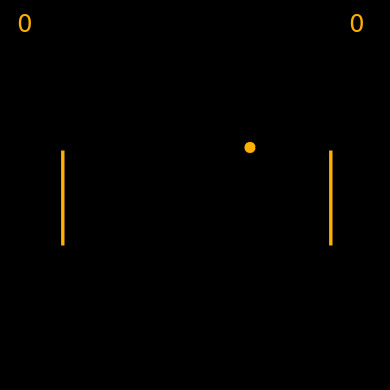

# UTK HCI / Pong

__Project Description__: Pong w/ some awkward bonus features.

__Example:__



## Play

- <https://editor.p5js.org/nickhrsims/sketches/S-xLa9YUe>

## Build

```sh
yarn build
```

This will transpile source into a single p5js-compatible `sketch.js`.

This may be manually copied into any active p5js instance.
